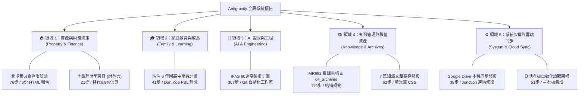

# 系統全局歷史對話整合任務看板 (Master Conversations Hub)

> [!NOTE]
> **系統狀態報告**：已成功診斷並修復本機 `brain` 目錄之 Directory Junction（重新鏈結至 `D:\我的雲端硬碟\AntigravitySync\brain`）。目前本機與雲端硬碟雙向同步已正常恢復，所有歷史對話資料庫（SQLite）與軌跡紀錄已完成 100% 全景掃描。

---

## 📊 全局 Kanban 任務進度看板

| 📋 待辦事項 (To Do) | 🔄 進行中 / 定期追蹤 (In Progress) | ✅ 已完成 (Done) | 📦 歷史封存 (Archived) |
| :--- | :--- | :--- | :--- |
| **土地銀行臨櫃諮詢** 🏷️ 房產財務 親洽土銀申辦「財夠力」理財型房貸額度與綁定存摺 | **浩浩六年自主學習計畫** 🏷️ 家庭教育 (41步) 每週落實 3 日共學、Trello 看板與實作專案驗證 [👉 進入對話](conversation://b16bed8c-b726-43ec-a05b-335be8cdbd7d) | **北屯房產與員林置產決策** 🏷️ 房產財務 (76步) 完成出租抗通膨與買賣正反辯論分析 [👉 進入對話](conversation://f2b000d8-e265-4f89-a62e-581e4d61629c) | **員林買賣前置評估** 🏷️ 房產財務 (17步) 已被 f2b000d8 完整承接 [👉 檢視對話](conversation://a4c34043-e3ca-4915-ae67-ff7c5df43f71) |
| **浩浩第一個自主專案** 🏷️ 家庭教育 讓浩浩自選一項電腦科技實作專案（PBL 模式） | **全系統對話整合看板 (當前)** 🏷️ 系統自動化 (本對話) 修復 brain 鏈結、全量萃取 14 對話、建置主卡片 [👉 進入對話](conversation://26694156-7129-4a14-ab7c-b06644e3a334) | **土地銀行理財型房貸評估** 🏷️ 房產財務 (21步) 釐清動用計息機制，推翻 6.9% 高利信貸 [👉 進入對話](conversation://2fcde031-faa6-485a-bb19-705bcb99a98e) | **初代對話總合看板** 🏷️ 系統自動化 (74步) 建立初代 Kanban 表格 [👉 檢視對話](conversation://96c2f333-5731-468c-b0ef-3a19505f2e39) |
| **iPAS 考前模擬實戰** 🏷️ AI 證照 利用 60 張術語卡進行考前快速翻牌測驗 | | **iPAS AI 應用規劃師術語庫** 🏷️ AI 證照 (367步) 完成 60 選術語卡、雙向導航、Git 推播自動化 [👉 進入對話](conversation://b769e1a0-a410-483c-9f73-3c76a7a3d669) | **看板任務查詢** 🏷️ 系統自動化 (16步) 查詢看板專案狀態 [👉 檢視對話](conversation://98bc48ff-4450-4348-9f8c-414d5aed5d9f) |
| | | **MR693 資料夾結構整頓** 🏷️ 知識資產 (119步) 04_archives 活化遷移、建立結構說明規範 [👉 進入對話](conversation://a8f15690-0ed5-4fba-8ddb-de0a911682f8) | **初始空白對話** 🏷️ 系統雜項 (2步) 已清理封存 [👉 檢視對話](conversation://0348385a-c1cb-45b9-b736-219c36c6d9ca) |
| | | **知識庫 7 篇精選文章高亮修復** 🏷️ 知識資產 (62步) 批次還原 HTML 螢光筆醒目標記 [👉 進入對話](conversation://0abdbd7b-2c88-49fd-9016-4ee1f4379708) | |
| | | **Google Drive 同步機制配置** 🏷️ 系統環境 (38步) 釐清雙向同步與本機常駐檔案設定 [👉 進入對話](conversation://4f6f48e6-539d-4305-be80-2a5a409b74a2) | |
| | | **系統級看板自動化研發** 🏷️ 系統自動化 (51步) 規劃 SQLite 與對話日誌讀取架構 [👉 進入對話](conversation://5a49ed95-ae44-406b-89c1-001a7379d104) | |
| | | **Obsidian 個人知識庫指引** 🏷️ 知識資產 (11步) 雲端硬碟筆記架構與 Notion 比較分析 [👉 進入對話](conversation://94e338df-31a9-4cfc-9e7e-f0dca8b07363) | |

---

## 🗂️ 5 大業務領域全景深層解析卡片

---

### 🏠 【領域 1】房產決策與資產配置 (Property & Financial Strategy)

> **相關對話**：
> - [👉 北屯賣房 vs 員林置產正反辯論與財務分析 (f2b000d8)](conversation://f2b000d8-e265-4f89-a62e-581e4d61629c) （76 步）
> - [👉 土地銀行理財型房貸 vs 80萬信貸深度評估 (2fcde031)](conversation://2fcde031-faa6-485a-bb19-705bcb99a98e) （21 步）
> - [👉 員林置產北屯賣房前置評估 (a4c34043)](conversation://a4c34043-e3ca-4915-ae67-ff7c5df43f71) （17 步）

#### 💡 核心論點與關鍵決策
1. **北屯房產策略定調（繼續出租為上策）**：
   - **客觀條件**：北屯房屋每月包租代管穩定租金收入 2.5 萬+，房貸為青年安心成家貸款加身心障礙利息補貼，每月僅需繳約 8,900 元（借貸 20 年，自 2022 年起算）。
   - **家庭現況**：太太與小孩設籍員林並住娘家就近照料父親；本人設籍北屯，在嘉義工作租屋（月租 5,000 元含水電）；郵局工作正式調動時間為 **2028 年 7 月**。
   - **關鍵決策**：在 2028 年調動前，堅決保留北屯房屋收租。若急於售屋將面臨買方市場拖延核貸、管理費/水電空置成本及空窗期借貸度日的惡性循環。「以租金現金流養房+抗通膨」是當前最具防禦性的最佳解。
2. **融資與現金流策略（推翻高利信貸，採理財型房貸備援）**：
   - 徹底推翻向一般銀行借貸「80萬、10年、6.9%利率」之信貸方案，避免每月背負高額固定本息攤還壓力。
   - 確立以現有土地銀行房貸基礎，申辦**土銀「財夠力」理財型房貸**：有動用才按日計息、隨借隨還、存入即停止計息，適合作為家庭「6 個月緊急預備金」的安全防護網，工作結餘再有節奏地投入 0050 等被動資產。

#### 📄 產出報告與文件索引
- 📑 [`員林置產北屯賣房規劃報告_2026v2.html`](file:///C:/Users/Kevin/.gemini/antigravity/brain/f2b000d8-e265-4f89-a62e-581e4d61629c/員林置產北屯賣房規劃報告_2026v2.html)
- 📑 [`租vs賣最終辯論分析_2026.html`](file:///C:/Users/Kevin/.gemini/antigravity/brain/f2b000d8-e265-4f89-a62e-581e4d61629c/租vs賣最終辯論分析_2026.html)
- 📑 [`個人化策略分析_2026.html`](file:///C:/Users/Kevin/.gemini/antigravity/brain/f2b000d8-e265-4f89-a62e-581e4d61629c/個人化策略分析_2026.html)
- 📑 [`信貸60萬分析_2026.html`](file:///C:/Users/Kevin/.gemini/antigravity/brain/f2b000d8-e265-4f89-a62e-581e4d61629c/信貸60萬分析_2026.html)
- 📑 [`北屯策略評估問卷_2026.html`](file:///C:/Users/Kevin/.gemini/antigravity/brain/f2b000d8-e265-4f89-a62e-581e4d61629c/北屯策略評估問卷_2026.html)

---

### 🎓 【領域 2】家庭教育與成長藍圖 (Family Growth & Education)

> **相關對話**：
> - [👉 家裡老大浩浩六年自主學習規劃與教育藍圖 (b16bed8c)](conversation://b16bed8c-b726-43ec-a05b-335be8cdbd7d) （41 步）

#### 💡 核心理念與實踐體系
1. **打破填鴨補習，啟動自主探索**：
   - 針對浩浩（國中至高中為期六年）的學習特性：喜愛電腦科技、課業需引導督促、對數學與本土語言較有挫折感。
   - 放棄傳統耗時且扼殺興趣的補習班，支持技職或興趣專長發展，以「孩子快樂、能自主投入熱愛事物」為核心指標。
2. **內化 Dan Koe 現代學習與創作哲學**：
   - **從專案 (Project) 開始，而非從課程 (Learning) 開始**：以具體實作（寫程式、組裝、做作品）暴露知識缺口，在解題中學習。
   - **擁抱掙扎與錯誤**：錯誤不是失敗，而是神經迴路固化知識的最佳訊號。
   - **第二大腦為「創作燃料庫」**：不囤積死知識，筆記系統隨時為進行中的專案服務。
   - **AI 作為降低摩擦的槓桿**：運用 AI 整理資料與解題，但保留個人的品味、核心思考與策展能力。
3. **家長角色與協同工具**：
   - 建立系統讓浩浩逐步自主，家長只做大方向檢核，每週安排 3 日固定共學共讀。
   - 使用平板搭配 Trello 看板進行目標拆解與任務共享。

#### 📄 產出報告與文件索引
- 📑 [`hao_hao_learning_plan_dashboard.html`](file:///C:/Users/Kevin/.gemini/antigravity/brain/b16bed8c-b726-43ec-a05b-335be8cdbd7d/hao_hao_learning_plan_dashboard.html)

---

### 🚀 【領域 3】AI 專業證照與工程建置 (AI Certification & Engineering)

> **相關對話**：
> - [👉 iPAS AI 應用規劃師術語庫擴充與 Git 自動化 (b769e1a0)](conversation://b769e1a0-a410-483c-9f73-3c76a7a3d669) （367 步）

#### 💡 核心成果與技術鏈
1. **iPAS 核心高頻術語 60 選必備卡**：
   - 依照初級與中級能力指標，將原本 18 個名詞全面擴充至完整 60 張關鍵術語卡。
   - 實現從 `index.html` 到初級、中級各分流網頁的雙向往返導航，連結完整度達 100%。
2. **跨年齡理解的教材翻轉（8歲到80歲）**：
   - 將專業生硬的 AI 理論以生活化、故事化案例重構，使學習者能秒懂直覺概念。
3. **自動化工程與工作流推播**：
   - 本機 Windows 環境下無縫配置 Git 自動化安裝、認證引導與遠端代碼推播機制。
   - 率先驗證「由系統讀取對話日誌以萃取任務」的可行性，奠定看板系統基礎。

---

### 📚 【領域 4】知識管理與數位資產重構 (Knowledge Management & Archives)

> **相關對話**：
> - [👉 MR693 資料夾結構整頓與 04_archives 活化 (a8f15690)](conversation://a8f15690-0ed5-4fba-8ddb-de0a911682f8) （119 步）
> - [👉 知識庫 7 篇精選文章高亮螢光修復 (0abdbd7b)](conversation://0abdbd7b-2c88-49fd-9016-4ee1f4379708) （62 步）
> - [👉 Obsidian 個人知識庫建置指南 (94e338df)](conversation://94e338df-31a9-4cfc-9e7e-f0dca8b07363) （11 步）

#### 💡 核心成果與架構規範
1. **MR693 目錄大重構與資產活化**：
   - 打散帶有日期與無效層級的舊資料夾，將檔名前綴標準化，釋放寶貴硬碟空間。
   - 將 `04_archives` 中具有價值的公用模板安全萃取並遷移至 `03_resources`。
   - 建立根目錄全域說明規範檔 [`directory_structures.md`](file:///D:/我的雲端硬碟/AntigravitySync/directory_structures.md)（所有新增、修改、刪除操作皆遵循此規範）。
2. **知識庫文章視覺修復**：
   - 批次修復 7 篇重要文章（涵蓋高效率思考、個體創業一人公司、健康壽命前沿研究等），修正文字轉碼遺失之問題，恢復色彩醒目的現代扁平化螢光筆標記。
3. **知識庫工具選型指引**：
   - 評估 Notion（適合即時協同與資料庫篩選）與 Obsidian（適合純文本本地長期保存、雙向鏈結與隱私）。

---

### ⚙️ 【領域 5】系統架構、雲端同步與看板演進 (System Architecture & Sync)

> **相關對話**：
> - [👉 本對話：全系統對話整合與主任務卡片建立 (26694156)](conversation://26694156-7129-4a14-ab7c-b06644e3a334)
> - [👉 Google Drive 同步設定與本機常駐檔案指南 (4f6f48e6)](conversation://4f6f48e6-539d-4305-be80-2a5a409b74a2) （38 步）
> - [👉 系統內建任務管理看板研發探討 (5a49ed95)](conversation://5a49ed95-ae44-406b-89c1-001a7379d104) （51 步）
> - [👉 初代 Kanban 看板實作 (96c2f333)](conversation://96c2f333-5731-468c-b0ef-3a19505f2e39) （74 步）
> - [👉 Kanban 任務清單查詢 (98bc48ff)](conversation://98bc48ff-4450-4348-9f8c-414d5aed5d9f) （16 步）

#### 💡 核心成果與底層架構修復
1. **本機目錄 Junction 修復（關鍵修復）**：
   - 診斷發現本機 `C:\Users\Kevin\.gemini\antigravity\brain` 指向之目標目錄先前因資料夾更名而失效，已在本次任務中即時重建 Directory Junction，精準映射至 `D:\我的雲端硬碟\AntigravitySync\brain`，保證所有對話日誌與產物在 Google Drive 即時備份！
2. **Google Drive 本機同步最佳實踐**：
   - 釐清 Google Drive 電腦版之「串流檔案」與「雙向同步」機制，指導在同步目錄啟用「一律保留在此裝置上 (Always keep on this device)」，防止 Antigravity 讀取時因雲端占位符延遲而報錯。
3. **從靜態展示到系統自動解析**：
   - 實踐了直接讀取系統內部 SQLite 資料庫 (`steps`, `trajectory_meta`) 與 JSONL 軌跡日誌，無需手動複製貼上，實現真實、無摩擦的跨對話進度掌握。

---

## 🎯 建議後續關鍵行動清單 (Action Plan)

1. **財務防護網**：擇期前往土地銀行詢問將北屯現有房貸增開「財夠力」理財型房貸之手續與利率，備妥動用額度作為不時之需。
2. **浩浩共學啟動**：挑選浩浩最感興趣的一項主題（如 Scratch 遊戲設計、電腦硬體小專案），運用 Trello 開設第一個實作看板。
3. **AI 證照衝刺**：隨時開啟 `ai-core-50-terms.html` 的 60 張術語卡進行隨機抽考，鎖定高頻必備觀念。
4. **看板日常更新**：後續若有新開啟之獨立對話，可隨時喚醒本任務卡片，自動追加索引與進度關聯！
